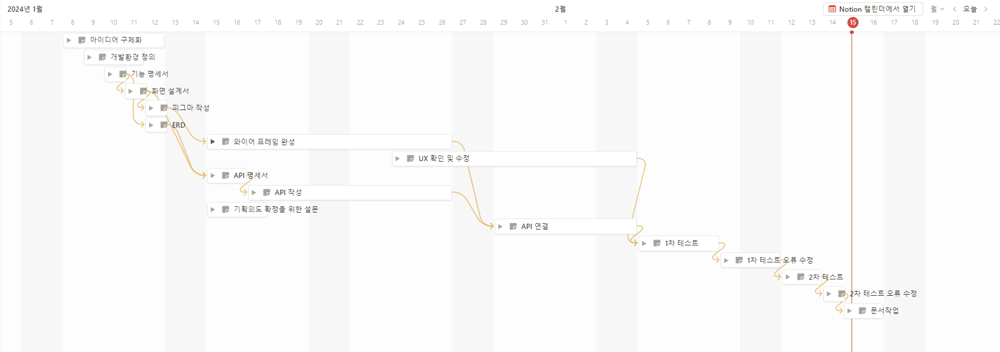
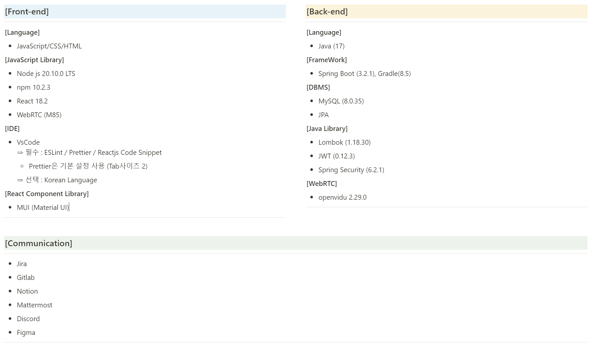

# 
본인의 면접 질문을 저장 및 관리가 가능하며, 이를 다른 사람들과 공유할 수 있는 서비스
```
💡 "혼자서는 빨리 갈 수 있지만, 함께라면 더 멀리 갈 수 있다."
```

<br>

**프로젝트에 대한 자세한 정보는 [🔗여기](https://www.notion.so/ArchiVIEW-f80411bf395f423a83470e3752959183)**

<br>

## 👦 팀원
| 오철수 | 박찬홍 | 조영진 | 정인상 | 김태완 | 박영준 |
|--------|--------|--------|--------|--------|--------|
| - 오철수 쓰고싶은말1<br>- 쓰고싶은말2 | - 박찬홍 쓰고싶은말1<br>- 쓰고싶은말2 | - 조영진 쓰고싶은말1<br>- 쓰고싶은말2 | - 정인상 쓰고싶은말1<br>- 쓰고싶은말2 | - 김태완 쓰고싶은말1<br>- 쓰고싶은말2| - 박영준 쓰고싶은말1<br>- 쓰고싶은말2 |

<br>

## 📅 개발일정


<br>

## 💰 서비스 가치
- [🔗설문 결과](https://leeward-letter-425.notion.site/256e4cf5a94e4b3cab78c7bac1204b3d), 사이트를 이용한 면접 관리 사이트는 **블루오션**
    - 면접 관리를 하는 인원은 절반도 되지 않으며, 한다 하더라도 대부분 개인 저장을 함 
- 본인만의 면접 질문을 저장하고, 태그별로 관리 가능
- 공유를 희망하는 유저에 한하여 타인의 면접 영상을 열람 가능

<br>

## 🔧 서비스 기능
| 기능 | NON-LOGIN | LOGIN-USER | MEMBER | ADMIN |
|-----------|------|--------|-------|-------|
|취업 캘린더|O|O|O|O|
|질문 상세검색|O|O|O|O|
|질문 등록|X|O|O|O|
|내 질문 관리|X|O|O|O|
|마이페이지|X|O|O|O|
|질문 상세조회|X|X|O|O|
|회원 관리|X|X|X|O|

<br>

## 🧰 기술 스택


<br>

## 📦 프로젝트 구조

#### 아키텍쳐

#### 프론트엔드 파일구조
```
FRONT-END
│  App.js
│  index.js
│  reportWebVitals.js
│  setupProxy.js
│  setupTests.js
│  
├─api
│      adminAPI.js
│      calendarAPI.js
│      commonsAPI.js
│      mypageAPI.js
│      naverAPI.js
│      openViduAPI.js
│      questionAPI.js
│      replyAPI.js
│      userAPI.js
│      
├─assets
│  ├─css
│  │      App.css
│  │      CAL_M_01.css
│  │      CAL_P_01.css
│  │      HOM_P_01.css
│  │      LOG_M_01_login.css
│  │      MYI_P_02.css
│  │      
│  ├─font
│  │      Pretendard-Regular.ttf
│  │      
│  └─img
│          colorLogo-removebg-preview.png
│          instagram.jpg
│          jjangoo.jpg
│          loading.gif
│          mainLogo-removebg-preview.png
│          mainLogo_noSlogun-removebg-preview.png
│          symbolLogo-removebg-preview.png
│          symbolLogo_Slogun-removebg-preview.png
│          user.png
│          video.png
│          
├─components
│  ├─ADM_P_01
│  │      manageAccount.js
│  │      manageGrade.js
│  │      
│  ├─HOM_M_01
│  │      btnGroupInsert.jsx
│  │      
│  ├─LOG_M_01
│  │      assignUser.jsx
│  │      changePWModal.jsx
│  │      findIDModal.jsx
│  │      findIDResult.jsx
│  │      findPWModal.jsx
│  │      loginModal.jsx
│  │      
│  ├─MYI_P_01
│  │      accordion.jsx
│  │      profileSection.jsx
│  │      
│  ├─MYI_P_02
│  │      btnGroupInsert.jsx
│  │      confirmModal.jsx
│  │      insertForm.jsx
│  │      modifyForm.jsx
│  │      myNavbar.jsx
│  │      openVideo.jsx
│  │      
│  ├─MYP_P_01
│  │      actionButton.jsx
│  │      adminButton.jsx
│  │      passwordCheck.jsx
│  │      passwordModal.jsx
│  │      profileSection.jsx
│  │      
│  ├─MYP_P_02
│  │      confirmModal.jsx
│  │      infoSection.jsx
│  │      profileSection.jsx
│  │      saveButton.jsx
│  │      
│  ├─SCH_P_01
│  │      autoCompleteCompo.jsx
│  │      firstTabFirstList.jsx
│  │      firstTabSecondList.jsx
│  │      fitstTabFirstListCompo.jsx
│  │      secondTabFirstList.jsx
│  │      secondTabFirstListCompo.jsx
│  │      secondTabSecondList.jsx
│  │      tabCompo.jsx
│  │      tagListCompo.jsx
│  │      
│  └─utils
│          alertModal.jsx
│          footer.jsx
│          loading.jsx
│          navbar.jsx
│          navbarComponent.jsx
│          searchSection.jsx
│          
├─hoc
│      adminAuth.jsx
│      memberAuth.jsx
│      userAuth.jsx
│      
├─pages
│      ADM_P_01.jsx
│      CAL_M_01.jsx
│      CAL_P_01.jsx
│      HOM_M_01.jsx
│      HOM_P_01.jsx
│      LOG_M_01.jsx
│      MYI_P_01.jsx
│      MYI_P_02.jsx
│      MYI_P_02_Modify.jsx
│      MYP_P_01.jsx
│      MYP_P_02.jsx
│      SCH_P_01.jsx
│      
└─utils
        cookie.js
        httpCommons.js
        httpStatusCode.js
        transformEventData.js
        useForm.js
```

#### 백엔드 파일구조
```
BACK-END
├─.idea
├─Archiview
│  ├─gradle
│  │  └─wrapper
│  └─src
│      ├─main
│      │  ├─java
│      │  │  └─com
│      │  │      └─####
│      │  │          └─archiview
│      │  │              ├─config
│      │  │              ├─controller
│      │  │              │  ├─admin
│      │  │              │  ├─common
│      │  │              │  ├─question
│      │  │              │  ├─recruit
│      │  │              │  ├─reply
│      │  │              │  ├─token
│      │  │              │  └─user
│      │  │              ├─dto
│      │  │              │  ├─comment
│      │  │              │  ├─common
│      │  │              │  ├─company
│      │  │              │  ├─mail
│      │  │              │  ├─question
│      │  │              │  ├─recruit
│      │  │              │  ├─reply
│      │  │              │  ├─token
│      │  │              │  └─user
│      │  │              ├─entity
│      │  │              ├─filter
│      │  │              ├─jwt
│      │  │              ├─repository
│      │  │              │  ├─Question
│      │  │              │  └─Recruit
│      │  │              ├─response
│      │  │              │  ├─code
│      │  │              │  ├─exception
│      │  │              │  ├─handler
│      │  │              │  └─structure
│      │  │              ├─service
│      │  │              │  ├─common
│      │  │              │  ├─question
│      │  │              │  ├─recruit
│      │  │              │  ├─reply
│      │  │              │  ├─token
│      │  │              │  └─user
│      │  │              └─validation
│      │  │                  └─user
│      │  └─resources
│      │      └─ssl
│      └─test
│          └─java
│              └─com
│                  └─####
│                      └─archiview
└─SignalingServer
    ├─gradle
    │  └─wrapper
    └─src
        ├─main
        │  ├─java
        │  │  └─com
        │  │      └─####
        │  │          └─archiview
        │  │              └─signalingserver
        │  │                  ├─config
        │  │                  └─controller
        │  └─resources
        │      └─ssl
        └─test
            └─java
                └─com
                    └─####
                        └─archiview
                            └─signalingserver

```

